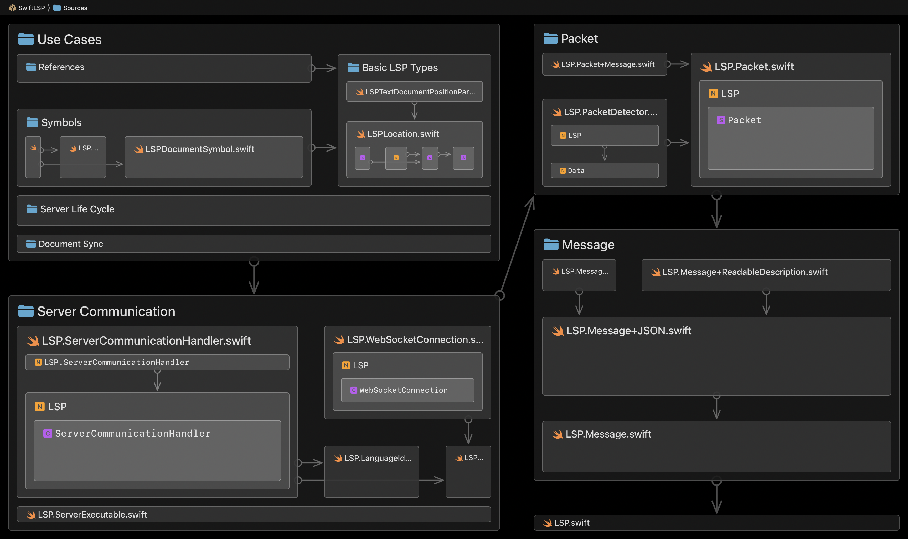

# SwiftLSP

👩🏻‍🚀 *This project [is still a tad experimental](#development-status). Contributors and pioneers welcome!*

## What?

SwiftLSP employs a quite dynamic Swift representation of the [LSP (Language Server Protocol)](https://microsoft.github.io/language-server-protocol) and helps with:

* Launching an LSP server executable
* Extracting LSP Packets from a data stream
* Encoding and decoding LSP messages
* Representing, creating and working with LSP messages
* Matching response messages to request messages
* Exchanging LSP Messages with an LSP Server
* Exchanging LSP Messages with an LSP Server via WebSocket

SwiftLSP is the basis for [LSPService](https://github.com/codeface-io/LSPService) and [LSPServiceKit](https://github.com/codeface-io/LSPServiceKit).

## Architecture

Some context and essential types:

Internal architecture (composition and essential dependencies) of the top-level source folder:

The above image was generated with the [codeface app](https://codeface.io).

## Development Status

From version/tag 0.1.0 on, SwiftLSP adheres to [semantic versioning](https://semver.org). So until it has reached 1.0.0, its API may still break frequently, but this will be expressed in version bumps.

SwiftLSP is already being used in production, but [Codeface](https://codeface.io) is still its primary client. SwiftLSP will move to version 1.0.0 as soon as its basic practicality and conceptual soundness have been validated by serving multiple real-world clients.